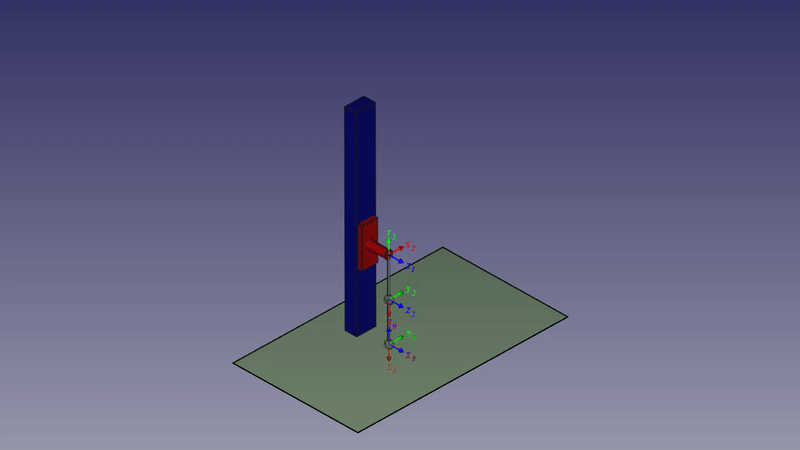

# Animate
An animation FreeCAD workbench

The aim of this workbench is to facilitate an easy way to make animations of your mechanical project.
At this point, it provides 7 tools:

* General tools:
	* Server
	* Trajectory
	* Control
	* Collision Detector

Using them you can move objects along trajectories. A trajectory is specified by assigned poses at given times. 
Then you can record this movement into series of images and export as a video afterwards.

* Tools focused on robotics
	* RobWorld
	* RobRotation
	* RobTranslation

These tools can be used to control a robot consisting of separate parts/links. Motion of those parts is 
described using Denavit-Hartenbergs notation for Revolute and Prismatic joints represented by 
RobRotation and RobTranslation tools respectively. For more info check [User Guide](https://jirivalasek.github.io/Animate/), [Documentation](https://jirivalasek.github.io/Animate/Documentation/index.html) or [Double pendulum example](https://github.com/JiriValasek/Animate/tree/master/Examples/Robotics/Double%20pendulum).

## Getting Started, User Guide & Documentation 

All you need to know you'll find out on [Animate website](https://jirivalasek.github.io/Animate/)
So let's go take a look.

## Future plans

The future plans include making Camera and Endpoint tool. Camera tool will change viewport's location and shape in time according to setting and Endpoint tool will make a graph of it's position (velocity, acceleration) in time. Also server focused on working with Animate tools is planned, it should be able to send numbers in their binary form instead of string one.

## License

* The Animate workbench (all that is inside *Animate* folder) is licensed under [LGPL license](https://github.com/JiriValasek/Animate/blob/master/Animate/LICENSE). This license does not extend itself to the rest of this repository.
* The Examples (all that is inside *Examples* folder) is licensed under more permissive [MIT license](https://github.com/JiriValasek/Animate/blob/master/Examples/LICENSE). This license does not extend itself to the rest of this repository.

## Authors

**Jiří VALÁŠEK**  

## Acknowledgments

I'd like to thank to FreeCAD community for responding to my questions in the [FreeCAD Forum](https://forum.freecadweb.org/).